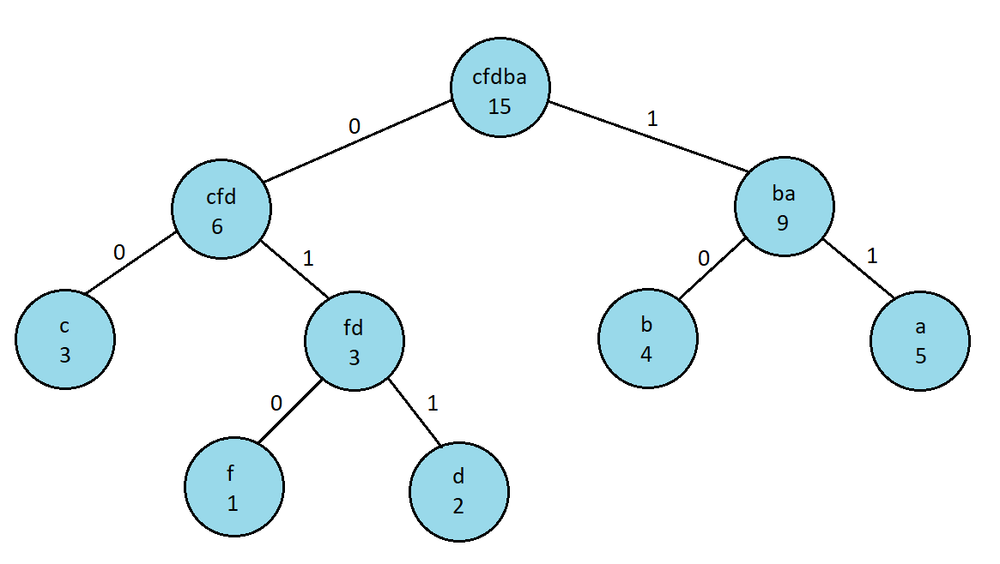

## Data Structures Project 3 - Huffman Coding

*Huffman Coding* is an encoding algorithm for lossless data compression developed by
David A. Huffman in 1952. The compression works by replacing characters which take 8 bits,
with a with a binary number, where each digit takes 1 bit. To create the Huffman Code,
we must first calculate the frequency distribution of the input string. Let’s say that our input
string is "aaaaabbbbcccddf", then our frequency distribution would be:

| Symbol | Frequency |
|:------:|:---------:|
|   a    |     5     |
|   b    |     4     |
|   c    |     3     |
|   d    |     2     |
|   f    |     1     |

We then take the frequency distribution table and for each symbol we create a binary tree node
that contains its symbol and frequency. We store the nodes in a sorted list, where each node is sorted
using its frequency, having the lowest be first, but if they have the same frequency then we use 
lexicographical order. Then we remove the two lowest nodes from the list, we create a parent node,
where its left child is the first node removed from the list, and its right child is the second removed 
node. The parent’s symbol is equal to the combination of its children’s symbols and its frequency
is the sum of its children's frequencies. We then add the parent node to the sorted list and continue 
repeating the process until there is only one node left in the list, this node is the root of our tree.
Below you can see the code for this algorithm and a visual representation of the Huffman Tree.

```java
/**
 * Takes the frequency distribution map and creates a binary tree where the lower the 
 * frequency of a character, the deeper it will be in the tree. 
 * 
 * @param frequencyDistribution map containing characters as keys and their frequencies as values
 * @return root node of the huffman tree
 */
public BTNode<Integer, String> huffman_tree(Map<Character, Integer> frequencyDistribution) {
	SortedList<BTNode<Integer, String>> sortedList = generateFDSortedList(frequencyDistribution);
	
	while (sortedList.size() > 1) { // iterates until only one node remains in the list, this will be our root node
		// removes the two smallest nodes in the tree
		BTNode<Integer, String> a = sortedList.removeIndex(0); 
		BTNode<Integer, String> b = sortedList.removeIndex(0);
		
		// create a new node that has a frequency equal to a + b and a symbol equal to a + b
		// who's left child is a and its right child is b
		BTNode<Integer, String> parent = new BTNode<Integer, String>(a.getFrequency() + b.getFrequency(),
				                                                     a.getSymbol() + b.getSymbol(), a, b);
		/** since the nodes are in a sorted list, we already know that a.frequency <= b.frequency
		 *	the tie breaker is performed within BTNode.compareTo, where if two nodes have the same frequency
		 *	we proceed to compare the nodes based on their symbols.
		 *	@see BTNode.compareTo(BTNode)
		 */
		
		sortedList.add(parent); // add parent node to continue building tree
	}
	
	return sortedList.removeIndex(0); // there is only one node left in our list, this is the root node of the tree
}
```

 

Once we've created the Huffman Tree, we can proceed to the creation of the Huffman Code Table. We start
traversing the tree from the root until we reach a leaf, the path taken to reach the leaf is that leaf's 
Huffman Code, when we go left we add a 0, and when we go right we add a 1. Using this example, our Huffman
Code table would be:

| Symbol | Huffman Code |
|:------:|:------------:|
|   a    |       11     |
|   b    |       10     |
|   c    |       00     |
|   d    |      011     |
|   f    |      010     |

Notice that no Huffman Code is the prefix to another Huffman Code, that is because if
we had x = 1, and y = to 11, then the string "1111" could be interpreted as "xxxx" or "yy".

Using our example, we encode our original string "aaaaabbbbcccddf" into "111111111110101010000000011011010".
The original string would need 15 bytes, while our encoded string only needs 5 bytes. The encoded
string takes up 67% less space than the original string. 

To read up more about Huffman Coding, you can visit the following web articles:

Wikipedia: https://en.wikipedia.org/wiki/Huffman_coding#:~:text=In%20computer%20science%20and%20information,used%20for%20lossless%20data%20compression.&text=The%20output%20from%20Huffman%27s%20algorithm,a%20character%20in%20a%20file).

GeeksforGeeks: https://www.geeksforgeeks.org/huffman-coding-greedy-algo-3/
